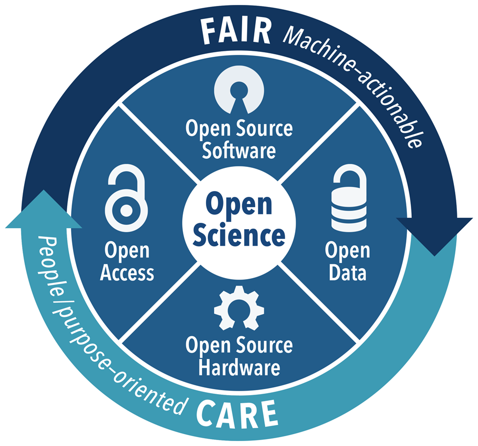

# Workshop Training


[](https://codespaces.new/SEEKCommons/WorkshopTraining)

This tutorial is intended to be executed in a Web browser without installing any software. To this end, this repository comes with a prebuild __[GitHub Codespaces](https://github.com/features/codespaces)__ configuration. Launch a Codespaces environment by clicking the banner __["Open in GitHub Codespaces"](https://codespaces.new/SEEKCommons/WorkshopTraining)__ and start evaluating the Jupyter notebooks (by placing the cursor into a code cell and pressing `Ctrl+Enter` or `Shift+Enter`). When prompted for a Python kernel, select
```
Python 3.10.13 ~/python/current/bin/python3
```

Some familiarity with Python is helpful, but not essential.  If you are new to Python, you sould be able to learn quite a bit just by clicking through the 
notebooks.

Notebooks for the workshop on Open Scientific Computing can be found in the 
"ScientificComputing" folder.

You are welcome to clone this repository and set up your local environment. *Notice that a few settings are specific to the Codespaces configuration and will need adjusting in a custom environment.* We recommend you review [`environment.yml`](./environment.yml) for Python package dependencies, and the files in [`.devcontainer`](./.devcontainer) for additional dependencies.

Enjoy and let us know what you think about these workshop materials! Please help us improve it by reporting __[issues](https://github.com/SEEKCommons/workshoptraining/issues)__ or submitting __[pull requests](https://github.com/SEEKCommons/workshoptraining/pulls)__!


